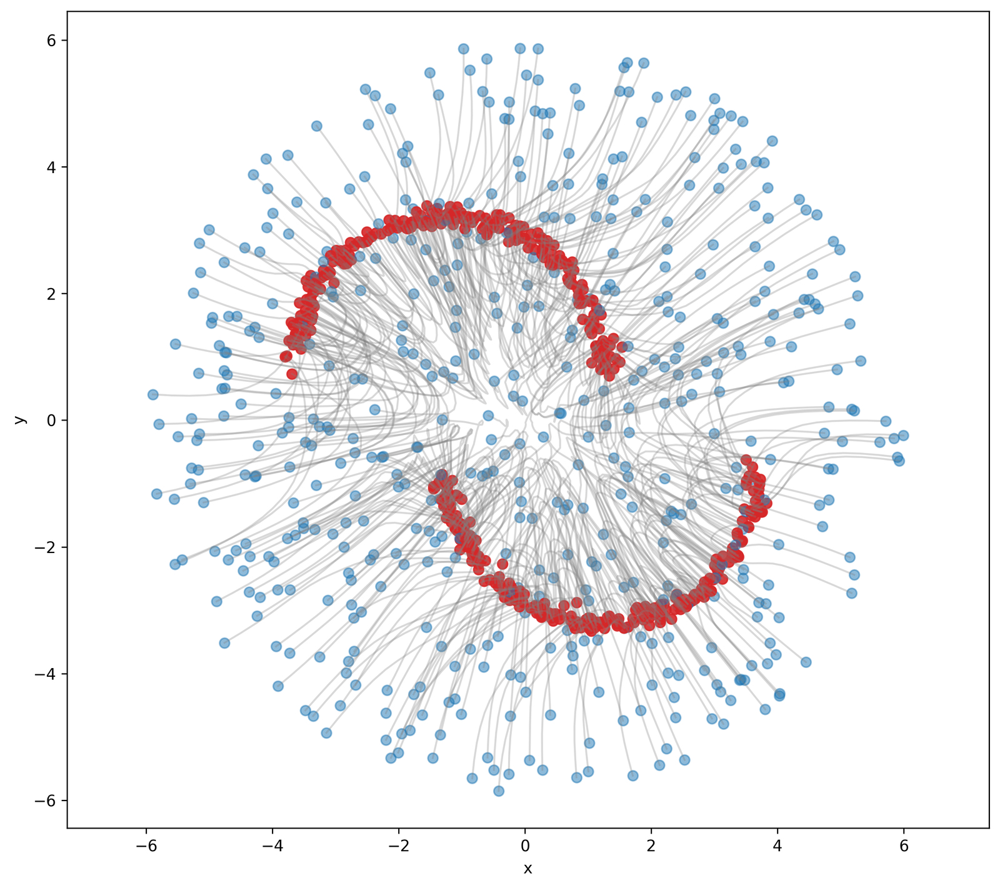

# Drift Flow Matching

**NeurIPS 2026** · Chenrui Ma, Xi Xiao, Lin Zhao, Tianyang Wang, Ferdinando Fioretto, Yanning Shen

[Paper](https://arxiv.org/abs/2605.17244) · [Project page](https://merry7cherry.github.io/drift-flow-matching/) · [Reproduction notes](reproduction/README.md)

Drift Flow Matching (DFM) learns transport between pairs of intermediate marginal distributions using a distribution-level drift objective. A two-time model supports direct one-step generation and multi-step refinement with the same parameters.



## Start here

| Module | What it contains | Start |
| --- | --- | --- |
| **Image generation** | Class-conditional MNIST and FFHQ latent generation, preprocessing, training, checkpoint sampling, and evaluation | [Installation and commands](image_generation/README.md) |
| **Generation trajectories** | Small synthetic experiments, DFM, Flow Matching and MeanFlow comparisons, checkpoint reuse, trajectory export | [CPU example and figure generation](generation_trajectory/README.md) |

Each module is independently installable with Python 3.11. Install only the module you need. Ordinary Python commands and explicit paths are sufficient; no cluster scheduler or institutional account is required. Model training budgets and device choices are documented per module.

## Release scope

This initial release covers **MNIST, FFHQ, and 2D synthetic trajectories**. It does not include the paper's ImageNet or robotic-control implementations.

**This is a source-and-training release; pretrained DFM checkpoints are not distributed.** Follow the [MNIST](image_generation/docs/datasets/mnist.md), [FFHQ](image_generation/docs/datasets/ffhq.md), or [trajectory](generation_trajectory/README.md) workflow to train your own models, then use the provided checkpoint sampling and evaluation commands.

The source has been streamlined to the paper's grouped, class-conditioned DFM objective. Later guidance and self-consistency experiments are not part of this release. Public configurations are reconstructed from available source and manuscript settings. **Original paper checkpoints and exact historical run configurations are not included.** The project page's archived figures and reported metrics are not newly reproduced results from this release. See [verification and limitations](reproduction/README.md) before making numerical comparisons.

## Repository map

```text
image_generation/        MNIST and FFHQ implementation
generation_trajectory/   synthetic transport implementation
reproduction/            protocols, scope, and figure provenance
docs/                    static project page
LICENSES/                retained third-party licenses
```

## Citation

```bibtex
@article{ma2026drift,
  title   = {Drift Flow Matching},
  author  = {Ma, Chenrui and Xiao, Xi and Zhao, Lin and Wang, Tianyang
             and Fioretto, Ferdinando and Shen, Yanning},
  journal = {arXiv preprint arXiv:2605.17244},
  year    = {2026}
}
```

## License and acknowledgements

Original DFM code and documentation are released under the [MIT License](LICENSE). ALAE-derived portions retain their Apache 2.0 license and notices.

The FFHQ autoencoder integration adapts parts of [ALAE](https://github.com/podgorskiy/ALAE), by Stanislav Pidhorskyi and collaborators. Please retain its Apache 2.0 notices. Dataset and pretrained-weight terms remain those of their original providers. See [third-party notices](THIRD_PARTY_NOTICES.md).
